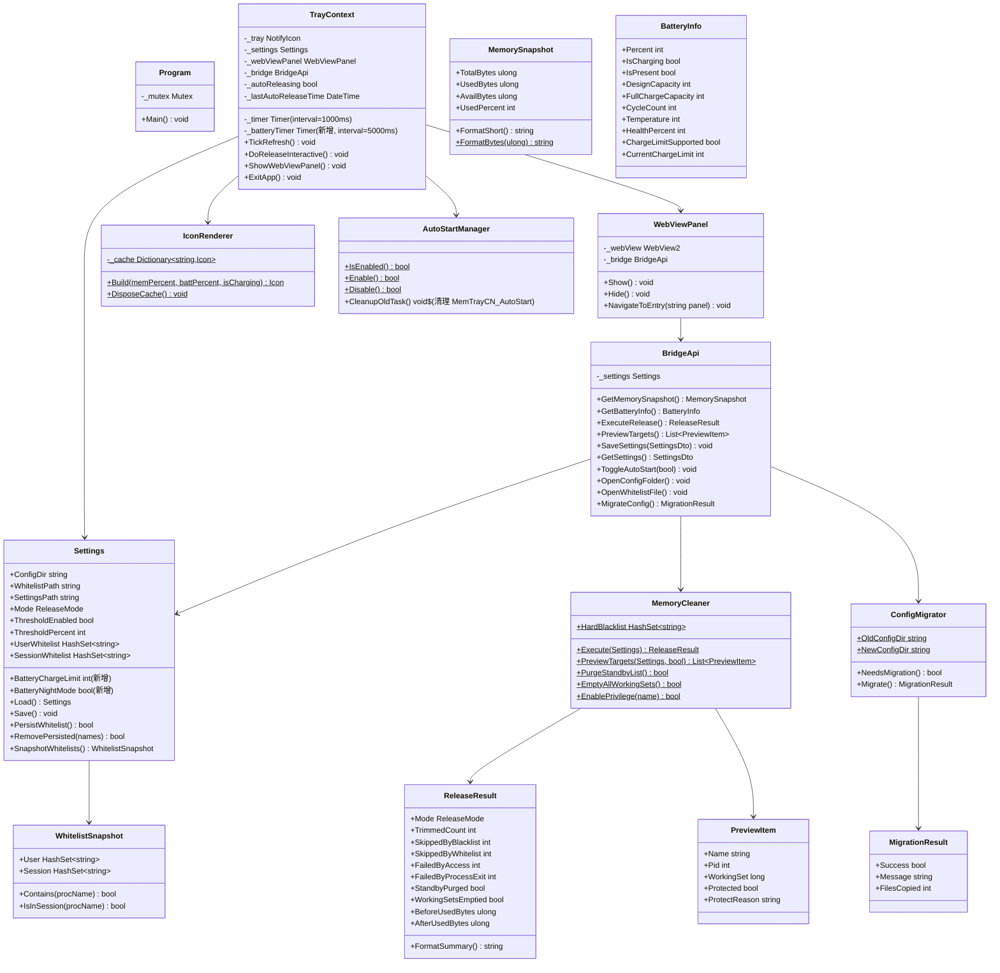
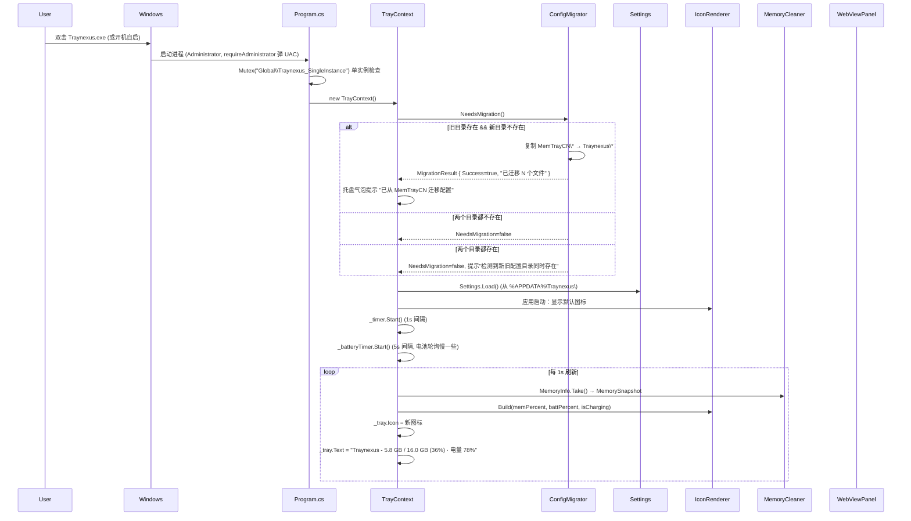
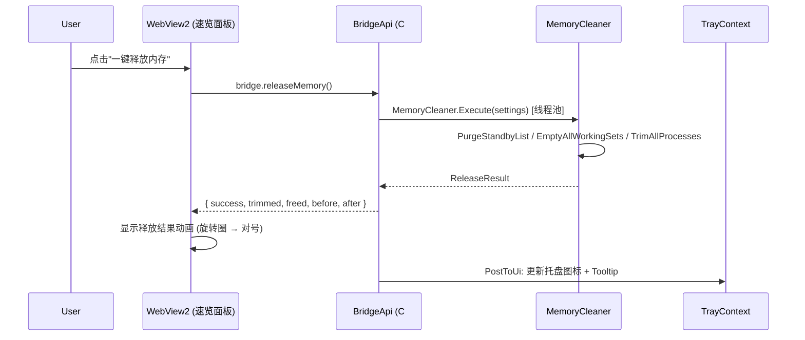
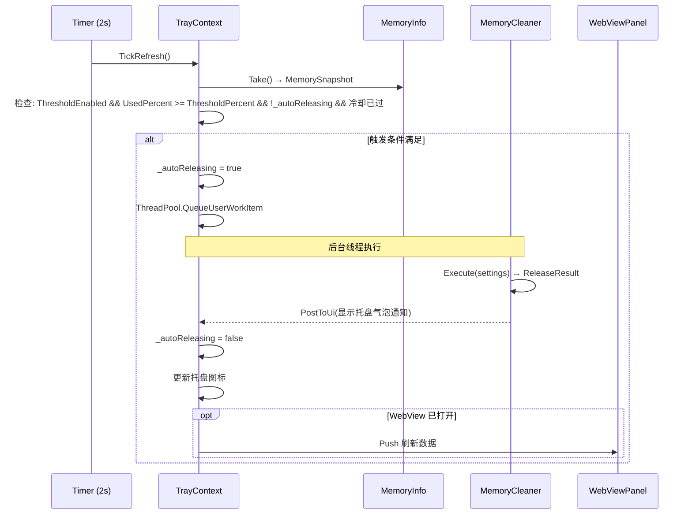
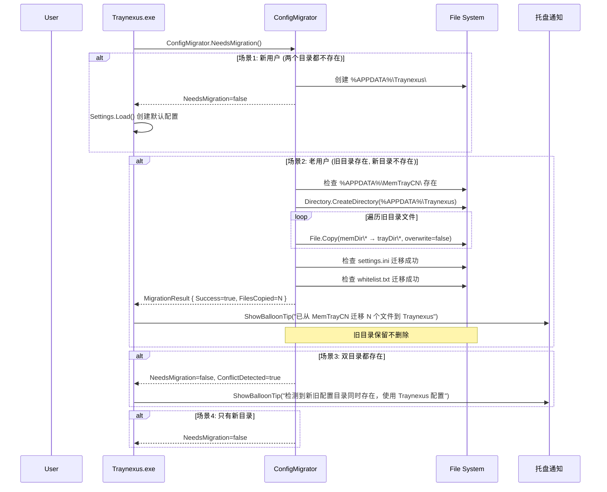
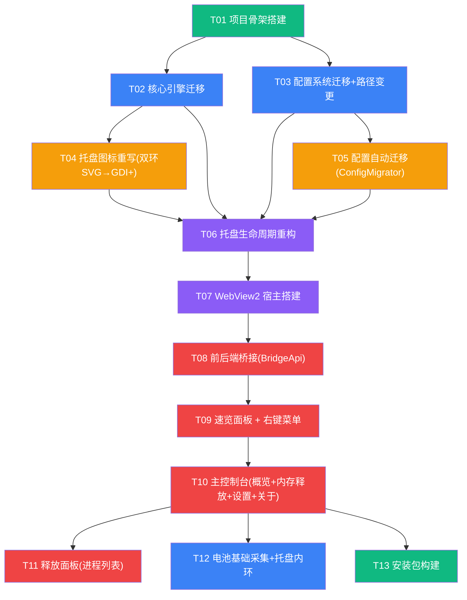

# Traynexus 合并项目 - 架构设计文档

## MemTrayCN v1.1 → Traynexus v1.0

| 文档信息 | |
|----------|------|
| 文档类型 | 技术架构设计 |
| 架构师 | 高见远 |
| 版本 | v1.0 |
| 日期 | 2026-07-14 |
| 上游文档 | [traynexus-merge-prd.md](./traynexus-merge-prd.md) |

---

## 目录

- [Part A: 技术栈选型分析](#part-a-技术栈选型分析)
- [Part B: 集成架构设计](#part-b-集成架构设计)
- [Part C: 任务分解](#part-c-任务分解)

---

## Part A: 技术栈选型分析

### 候选方案总览

根据 PRD 产品约束：免安装额外运行时、<500ms 内存操作响应、托盘原生渲染、速览面板和主控制台可接受 Web 技术栈，筛选出 4 个可行方向进行对比。

### A.1 方案对比表

| 维度 | 方案1: C# WinForms + WebView2 **(推荐)** | 方案2: Tauri (Rust + WebView) | 方案3: 纯 C# WPF | 方案4: Electron + C# Subprocess |
|------|------|------|------|------|
| **运行时依赖** | .NET Framework 4.8（Win10/11 预装）+ WebView2 Runtime（Win11 预装，Win10 1809+ 自动推送） | Rust 编译为原生 exe，不依赖 .NET；WebView2 仍需 Runtime | .NET Framework 4.8 系统自带 | Node.js + Electron（~180MB 裸 runtime） |
| **安装包体积** | ~5-8 MB（exe + HTML 资源 + WebView2 用系统共享 Runtime） | ~15-20 MB（Rust binary 本体 ~5MB + WebView 依赖） | ~3-5 MB（纯 .NET 程序集） | ~120-180 MB（Electron runtime 不可省略） |
| **代码复用率** | **95%** —— 8 文件全部直接复用，仅改命名空间+ConfigDir | 40% —— C# 引擎需独立 exe 通过 IPC 通信，托盘/菜单用 Rust 重写 | 70% —— 引擎层复用，UI 层需要完全重写 | 30% —— C# 引擎独立 subprocess，其余全部重建 |
| **托盘图标** | NotifyIcon + GDI+ 双环 SVG→Bitmap 预渲染缓存（101 个三级键缓存） | Tauri tray API + Rust image crate 动态生成 | NotifyIcon + GDI+（同方案1） | Electron Tray + NativeImage |
| **UI 还原度** | **100%** —— WebView2 加载原型 HTML，CSS/JS 直接复用，毛玻璃 backdrop-filter 支持 | 100% —— WebView 加载 HTML | 60-70% —— WPF 需从零实现毛玻璃效果（Acrylic/BlurEffect），Ultracode Canvas 动画可用 Win2D 但开发和调优成本高 | 100% —— 原型 HTML 直接复用 |
| **开发复杂度** | 低 —— 保留 MemTrayCN 骨架 + 嵌入 WebView2 作为"浏览器壳"，前后端桥接 < 200 行代码 | 高 —— 需学习 Rust、IPC 协议定义、Rust 侧 WMI 调用、C# 进程生命周期管理 | 极高 —— 双环弧线动画、毛玻璃面板、Ultracode Canvas（540 div → 1 canvas）、自定义下拉框均需用 WPF 重新实现 | 中 —— IPC 通信、进程管理、双重内存占用 |
| **内存操作性能** | **<200ms** —— 直接调用 C# MemoryCleaner.Execute()，零序列化开销 | 100-300ms —— 通过 IPC 管道/共享内存传递命令与结果 | <200ms —— 直接调用，但开发周期最长 | 50-200ms + IPC 开销 —— subprocess stdin/stdout 或 HTTP localhost |
| **调试/维护** | 简单 —— Visual Studio 单项目调试，C# 生态丰富 | 复杂 —— 需同时调试 Rust + JS + C# subprocess | 中等 —— Visual Studio 全托管 | 复杂 —— 需调试 Node 主进程 + C# subprocess + 前端 |
| **前景风险** | WebView2 Runtime 在精简版 Windows/LTSC 可能缺失，需降级方案（提示安装 WebView2 或 fallback 到 WinForms 原生面板） | Tauri 生态变化快，Windows 托盘 API 不够成熟 | WinForms→WPF 重写工作量相当于重写 80% 项目 | Electron 体积过大违反 PRD 约束，内存占用高（Electron 主进程 ~200MB + C# subprocess ~50MB） |

### A.2 方案评级与推荐

| 方案 | 综合评分 | 推荐等级 |
|------|---------|---------|
| 方案1: C# WinForms + WebView2 | ★★★★★ | **强烈推荐 —— 首选方案** |
| 方案2: Tauri | ★★★☆☆ | 备选 —— WebView2 缺失场景下的跨平台未来方案 |
| 方案3: 纯 WPF | ★★☆☆☆ | 不推荐 —— 开发周期与收益不成正比 |
| 方案4: Electron | ★☆☆☆☆ | 不推荐 —— 违反 PRD 安装包约束 |

### A.3 推荐方案详解：C# WinForms + WebView2

#### 为什么是它？

```
MemTrayCN 8文件全部复用 + WebView2加载原型HTML = 90%代码已就绪
                  ↓
        只需写"胶水层"：托盘图标重绘 + 前后端桥接 ≈ 600行新代码
```

**核心理念**：MemTrayCN 骨架完整且性能优异，只需把"脸"从 GDI+ WinForms 换成 Web 技术栈。WebView2 就是给 WinForms 装一个"漂亮浏览器壳"。

#### 运行时策略

| 场景 | 方案 |
|------|------|
| Windows 11 | WebView2 Runtime 预装，零额外依赖 |
| Windows 10 21H2+ | WebView2 Runtime 预装 |
| Windows 10 1809-21H1 | 系统更新自动推送 WebView2 |
| Windows 10 LTSC / 精简版 | 首次启动检测 WebView2 缺失 → 弹窗提示下载 Evergreen Bootstrapper（~2MB），无降级面板 |

> 备选：如产品不接受 WebView2 缺失时的阻断体验，可加一个 WinForms 原生"轻量版"速览面板（进度条 + 按钮，约 200 行），但 P0 不要求。

#### 代码复用清单

| MemTrayCN 文件 | 改动 | 新位置 |
|---------------|------|--------|
| `Program.cs` | Mutex 名 `MemTrayCN` → `Traynexus`，Application.Run 不变 | `src/Traynexus/` |
| `TrayContext.cs` | 命名空间改名；托盘图标改为双环 GDI+；右键菜单改为 4 项；左键事件绑定速览面板；`_timer` 增加电池轮询 | `src/Traynexus/` |
| `MemoryCleaner.cs` | 命名空间改名，其余 0 改动 | `src/Traynexus/` |
| `Settings.cs` | ConfigDir 路径 `MemTrayCN` → `Traynexus`；新增 `BatterySettings` 节 | `src/Traynexus/` |
| `MemoryInfo.cs` | 0 改动 | `src/Traynexus/` |
| `NativeMethods.cs` | 0 改动 | `src/Traynexus/` |
| `ReleasePanel.cs` | 完全重写：数据模型(PreviewItem)保留，UI 改为 WebView2 加载 HTML | 删除，逻辑并入 WebView 桥接 |
| `IconRenderer.cs` | 完全重写：从"数字百分比"改为"双环 SVG → GDI+ 弧线" | `src/Traynexus/` |
| `app.manifest` | 保留 requireAdministrator | `src/Traynexus/` |

**复用结果**: 327 行 MemoryCleaner + 348 行 Settings + 84 行 NativeMethods + 55 行 MemoryInfo + 42 行 Program = **856 行直接复用**（约 71%），剩余 TrayContext(513行) 和 IconRenderer(134行) 改造，ReleasePanel(200行) 替换。

---

## Part B: 集成架构设计

### B.1 文件列表

```
Traynexus/                           # 新项目根目录
├── Traynexus.sln                    # VS 解决方案
├── build.bat                        # 构建脚本 (csc.exe)
├── build_installer.bat              # 安装包构建 (Inno Setup)
├── README.md
├── LICENSE
├── app.manifest                     # requireAdministrator ← 从 MemTrayCN 复用
├── logo.svg                         # 品牌 Logo
├── logo.ico                         # 静态应用图标
│
├── src/
│   ├── Traynexus/                   # 主项目 (C# WinForms)
│   │   ├── Program.cs               # [复用] 入口：Mutex 改名 Traynexus
│   │   ├── TrayContext.cs           # [改造] 托盘生命周期，增加 WebView2 宿主 + 电池轮询
│   │   ├── MemoryCleaner.cs         # [复用] 释放引擎，命名空间改名
│   │   ├── Settings.cs              # [复用] 配置，ConfigDir 改为 Traynexus
│   │   ├── MemoryInfo.cs            # [复用] 内存快照，0 改动
│   │   ├── NativeMethods.cs         # [复用] P/Invoke，0 改动
│   │   ├── IconRenderer.cs          # [重写] 双环 SVG → GDI+ 弧线图标
│   │   ├── BatteryInfo.cs           # [新增] 电池状态采集 (WMI)
│   │   ├── ConfigMigrator.cs        # [新增] MemTrayCN → Traynexus 配置自动迁移
│   │   ├── AutoStartManager.cs      # [提取] schtasks 开机自启逻辑从 TrayContext 拆出
│   │   ├── BridgeApi.cs             # [新增] WebView2 前后端桥接 (JS → C# API)
│   │   └── WebViewPanel.cs          # [新增] WebView2 宿主窗口
│   │
│   └── ui/                          # [新增] 前端资源
│       ├── traynexus-ui.html         # [改造] 从原型 HTML 提取核心 UI
│       ├── css/
│       │   └── style.css             # [提取] 从原型 HTML 提取样式
│       ├── js/
│       │   ├── app.js                # [新增] 应用主逻辑：页面切换、按钮事件绑定
│       │   ├── bridge.js             # [新增] window.chrome.webview 封装 → C# BridgeApi
│       │   ├── ultracode.js          # [提取] Ultracode Canvas 引擎（从原型提取）
│       │   └── release-panel.js      # [新增] 释放面板交互逻辑
│       └── assets/
│           └── logo.svg              # [复用] 内联到 HTML + 资源文件
│
├── resources/                        # [新增] 原生托盘图标资源
│   └── tray_default.ico             # 默认托盘图标（静止态）
│
├── docs/
│   ├── ARCHITECTURE.md               # 本文档
│   └── CONTRIBUTING.md
│
└── deliverables/
    ├── traynexus-merge-prd.md        # [已有] 产品需求文档
    └── traynexus-merge-architecture.md  # [本文档]
```

**文件统计**:
- 直接复用: 5 个文件 (~856 行)
- 需改造: 2 个文件 (~650 行)
- 新增: 7 个 C# 文件 + 4 个 JS/CSS 文件 (~1200 行)
- 删除: `ReleasePanel.cs` (WinForms 面板，替换为 WebView)

### B.2 核心类图



### B.3 程序调用流程

#### 3.1 启动流程时序图



#### 3.2 用户触发释放 + WebView 反馈流程



#### 3.3 阈值触发自动释放流程



### B.4 前后端桥接设计

#### 4.1 桥接方式选择

WebView2 提供三种 JS↔C# 通信方式，我们使用 **hostObject + InvokeScript 组合**：

| 方式 | 用途 | 数据流向 |
|------|------|---------|
| `webView.CoreWebView2.AddHostObjectToScript("traynexus", bridgeApi)` | JS 调用 C# 方法 | JS → C# |
| `webView.CoreWebView2.ExecuteScriptAsync(js)` 或 `.PostWebMessageAsJson(data)` | C# 推送数据给 JS | C# → JS |

**选择理由**：
- `AddHostObjectToScript` 是同步调用（对 JS 而言），API 返回 JavaScript `Promise`，UX 流畅
- `PostWebMessageAsJson` 用于 C# 定时器主动推送内存/电池数据到 WebView，避免 JS 轮询
- 不推荐 `webMessageReceived`（消息格式手动解析复杂），也不推荐 `InvokeScript`（仅字符串，类型不安全）

#### 4.2 BridgeApi 定义（C# → 暴露给 JS）

```csharp
[ClassInterface(ClassInterfaceType.AutoDual)]
[ComVisible(true)]
public class BridgeApi
{
    // --- 只读数据 ---
    public MemorySnapshot GetMemorySnapshot();
    public BatteryInfo GetBatteryInfo();

    // --- 操作 ---
    public ReleaseResultDto ExecuteRelease();
    public List<PreviewItemDto> PreviewTargets(bool includeProtected);

    // --- 设置 ---
    public SettingsDto GetSettings();
    public void UpdateSettings(SettingsDto dto);

    // --- 文件操作 ---
    public string GetWhitelistContent();
    public bool SaveWhitelist(IEnumerable<string> names);
    public void OpenConfigFolder();
    public void OpenWhitelistInNotepad();

    // --- 自启 ---
    public bool GetAutoStartState();
    public bool SetAutoStart(bool enable);

    // --- 系统链接 ---
    public void OpenUrl(string url);

    // --- 配置迁移 ---
    public MigrationResult CheckMigration();
}
```

#### 4.3 JS 端调用示例

```javascript
// bridge.js —— 封装 window.chrome.webview
const traynexus = window.chrome.webview.hostObjects.traynexus;

async function getMemorySnapshot() {
  return await traynexus.GetMemorySnapshot();
}

async function quickRelease() {
  const result = await traynexus.ExecuteRelease();
  return result; // { Mode, TrimmedCount, FreedBytes, BeforeUsedBytes, AfterUsedBytes, ... }
}
```

#### 4.4 C# 推送数据到 WebView

```csharp
// TrayContext.cs —— 定时器刷新后推送数据到已打开的 WebView 面板
private void PushDataToWebView()
{
    if (_webViewPanel == null || !_webViewPanel.IsVisible) return;

    var mem = MemoryInfo.Take();
    var bat = BatteryInfo.Take();
    var json = JsonConvert.SerializeObject(new {
        memory = mem,
        battery = bat,
        autoReleasing = _autoReleasing
    });
    _webViewPanel.PostMessage(json); // 内部调 CoreWebView2.PostWebMessageAsJson
}
```

**JS 端接收**:

```javascript
window.chrome.webview.addEventListener('message', function(e) {
    const data = JSON.parse(e.data);
    updateMemoryDisplay(data.memory);
    updateBatteryDisplay(data.battery);
});
```

#### 4.5 数据流向图

```
┌──────────────────────────────────────────────────┐
│                 C# WinForms 主进程                │
│                                                  │
│  MemoryInfo.Take() ──→ MemorySnapshot            │
│  BatteryInfo.Take() ──→ BatteryInfo              │
│         │                  │                     │
│         └──────┬───────────┘                     │
│                ↓                                  │
│         IconRenderer.Build()                     │
│                ↓                                  │
│         _tray.Icon = 新图标  ← (每1s)            │
│         _tray.Text = "..."                       │
│                │                                  │
│                ↓ (每1s, 仅当 WebView 可见时)      │
│         PostWebMessageAsJson(JSON)               │
│                │                                  │
│     ┌──────────┴──────────┐                      │
│     ↓                     ↓                      │
│  WebView2 (速览面板)   WebView2 (主控制台)       │
│  ← 被动接收 JSON 推送  ← 被动接收 JSON 推送      │
│  ← 用户操作调 Bridge    ← 用户操作调 Bridge       │
└──────────────────────────────────────────────────┘
```

### B.5 配置迁移流程



### B.6 托盘图标绘制方案

#### 6.1 SVG 双环 → GDI+ 动态 Icon

```
logo.svg 定义:
  外环: r=140, stroke=30, 橙色 #FF9F0A  → 映射为 内存占用%
  内环: r=100, stroke=26, 绿色 #34C759  → 映射为 电池电量%
  中心: 闪电符号, 黄色=充电中, 白色=未充电/电池供电
```

#### 6.2 IconRenderer 重写方案

```csharp
public static class IconRenderer
{
    // 缓存策略：三级键 => 减少缓存爆炸
    // mem% 有 101 个值（0-100），batt 简化到 11 级（0-100 每 10），isCharging 2 态
    // 总计 101 × 11 × 2 = 2222 个 Icon，可接受（每个 ~2KB，约 4.4MB）
    private static readonly Dictionary<(int mem, int battLevel, bool charging), Icon> _cache = new();
    private const int BATT_LEVELS = 11; // 0, 10, 20, ..., 100

    private static int QuantizeBattery(int percent)
        => Math.Clamp(percent / 10 * 10, 0, 100);

    public static Icon Build(int memPercent, int battPercent, bool isCharging)
    {
        int battLevel = QuantizeBattery(battPercent);
        var key = (memPercent, battLevel, isCharging);

        if (_cache.TryGetValue(key, out var cached))
            return cached;

        var icon = RenderDualRingIcon(memPercent, battPercent, isCharging);
        _cache[key] = icon;
        return icon;
    }

    private static Icon RenderDualRingIcon(int memPct, int battPct, bool charging)
    {
        int size = 64; // 高 DPI 用 64px 底图画，系统缩放时清晰
        using var bmp = new Bitmap(size, size);
        using var g = Graphics.FromImage(bmp);
        g.SmoothingMode = SmoothingMode.AntiAlias;

        int cx = size / 2, cy = size / 2;

        // 1. 外环轨道 (内存) —— 灰色底 + 橙色弧
        float outerR = 28f, outerStroke = 5f;
        DrawRing(g, cx, cy, outerR, outerStroke,
            Color.FromArgb(60, 60, 60), 1.0f);           // 轨道
        DrawRing(g, cx, cy, outerR, outerStroke,
            Color.FromArgb(255, 159, 10), memPct / 100f); // 填充弧

        // 2. 内环轨道 (电池) —— 灰色底 + 绿色弧
        float innerR = 20f, innerStroke = 4f;
        DrawRing(g, cx, cy, innerR, innerStroke,
            Color.FromArgb(60, 60, 60), 1.0f);
        DrawRing(g, cx, cy, innerR, innerStroke,
            Color.FromArgb(52, 199, 89), battPct / 100f);

        // 3. 中心闪电符号
        Color boltColor = charging ? Color.FromArgb(255, 214, 10) : Color.White;
        DrawBolt(g, cx, cy, 10f, boltColor);

        IntPtr hIcon = bmp.GetHicon();
        using var tmp = Icon.FromHandle(hIcon);
        return (Icon)tmp.Clone();
    }

    private static void DrawRing(Graphics g, float cx, float cy,
        float r, float stroke, Color color, float fillRatio)
    {
        if (fillRatio <= 0) return;
        float sweepAngle = 360f * fillRatio;
        // 从 12 点钟方向（-90°）顺时针绘制
        using var pen = new Pen(color, stroke) { StartCap = LineCap.Round, EndCap = LineCap.Round };
        g.DrawArc(pen, cx - r, cy - r, r * 2, r * 2, -90, sweepAngle);
    }

    private static void DrawBolt(Graphics g, float cx, float cy, float halfSize, Color color)
    {
        // 简化的闪电路径（相对坐标）
        using var pen = new Pen(color, 2.5f) { LineJoin = LineJoin.Round, StartCap = LineCap.Round, EndCap = LineCap.Round };
        PointF[] pts = new PointF[] {
            new(cx + 4, cy - halfSize),        // 顶部偏右
            new(cx - halfSize * 0.5f, cy + 2),  // 左下
            new(cx + 1, cy + 2),                // 中偏右
            new(cx - 2, cy + halfSize),         // 底部偏左
            new(cx + halfSize * 0.5f, cy - 2),  // 右上
            new(cx - 1, cy - 2),                // 中偏左
        };
        using var path = new GraphicsPath();
        path.AddPolygon(pts);
        using var brush = new SolidBrush(color);
        g.FillPath(brush, path);
        g.DrawPath(pen, path);
    }
}
```

#### 6.3 缓存策略

| 缓存级 | 键 | 值 | 数量 | 内存 |
|--------|----|----|------|------|
| 内存% | 0-100 | — | 101 | — |
| 电量级别 | 0,10,20,...,100 | — | 11 | — |
| 充电状态 | true / false | — | 2 | — |
| **总计** | 101 × 11 × 2 | Icon 实例 | **2,222** | ≈ 4.4 MB |

> 如果内存紧张，可改为"仅缓存当前值 + 渲染队列异步惰性生成"。

---

## Part C: 任务分解

### C.1 任务拓扑 (P0 首版 MVP)

任务按实现顺序排列，箭头 `→` 表示依赖关系。所有任务在 P0 范围内。



### C.2 任务清单

| ID | 标题 | 描述 | 依赖 | 涉及文件 | 工作量 |
|----|------|------|------|----------|--------|
| **T01** | 项目骨架搭建 | 创建 Traynexus 解决方案、项目结构、复制 MemTrayCN 源码到 `src/Traynexus/`、修改命名空间为 `Traynexus`、创建 UI 资源目录 | — | `Traynexus.sln`, `*.csproj`, 全部现有文件改名 | 小 |
| **T02** | 核心引擎迁移 | 确保 MemoryCleaner.cs / NativeMethods.cs / MemoryInfo.cs 在 Traynexus 命名空间下编译通过、零功能改动、测试 StandbyList + WorkingSet 释放 | T01 | `MemoryCleaner.cs`, `NativeMethods.cs`, `MemoryInfo.cs` | 小 |
| **T03** | 配置系统迁移+路径变更 | Settings.cs ConfigDir 从 `%APPDATA%\MemTrayCN` 改为 `%APPDATA%\Traynexus`；新增 BatterySettings 节（ChargeLimit, NightMode）；确保原子写入、白名单线程安全不变 | T01 | `Settings.cs` | 中 |
| **T04** | 托盘图标重写 | IconRenderer.cs 完全重写：从"数字百分比"改为"双环 GDI+ 弧线"；实现 DrawRing / DrawBolt；三级键缓存策略；高 DPI (64px 底图) | T02 | `IconRenderer.cs` (重写) | 中 |
| **T05** | 配置自动迁移 | 新增 ConfigMigrator.cs：检测 `%APPDATA%\MemTrayCN\` → 复制到 `%APPDATA%\Traynexus\`；四种场景处理（新用户/老用户/双目录/仅新目录）；托盘气泡通知迁移结果 | T03 | `ConfigMigrator.cs` (新增) | 小 |
| **T06** | 托盘生命周期重构 | 改造 TrayContext.cs：Mutex 改名为 `Traynexus`；右键菜单从 9 项精简为 4 项（控制台/偏好设置/关于/退出）；左键事件绑定速览面板弹出；`_timer` Interval 从 2000ms 改为 1000ms；增加 `_batteryTimer` (5000ms)；schtasks 任务名从 `MemTrayCN_AutoStart` 改为 `Traynexus_AutoStart`，首次启用时清理旧任务；提取 AutoStartManager | T02, T03, T05 | `TrayContext.cs` (重写), `AutoStartManager.cs` (新增) | 大 |
| **T07** | WebView2 宿主搭建 | 新增 WebViewPanel.cs：WinForms Form 嵌入 Microsoft.Web.WebView2.WinForms.WebView2；初始化 CoreWebView2Environment；加载本地 HTML 文件（`file:///` 或 `SetVirtualHostNameToFolderMapping`）；处理窗口尺寸 | T06 | `WebViewPanel.cs` (新增), `src/ui/` 目录 | 中 |
| **T08** | 前后端桥接 | 新增 BridgeApi.cs：定义并暴露所有 C# API 给 JS（GetMemorySnapshot / GetBatteryInfo / ExecuteRelease / PreviewTargets / GetSettings / UpdateSettings / 文件操作 / 自启控制）；实现 `AddHostObjectToScript`；实现 `PostWebMessageAsJson` 数据推送；新增 `bridge.js` 封装 `window.chrome.webview` | T07 | `BridgeApi.cs` (新增), `js/bridge.js` (新增) | 大 |
| **T09** | 速览面板 + 右键菜单 | 从 `traynexus-ui-prototype.html` 提取速览面板 HTML/CSS/JS 到 `src/ui/` ；实现左键弹出/收起；集成 Ultracode Canvas 引擎；一键释放按钮 → BridgeApi.ExecuteRelease → 释放动画（旋转圈→对号）；右键菜单布局（4 项）；Tooltip 实时数据绑定 | T08 | `traynexus-ui.html`, `css/style.css`, `js/app.js`, `js/ultracode.js` | 中 |
| **T10** | 主控制台构建 | 实现主控制台页面：概览（4 卡片）、内存释放设置（三开关防空选 + 阈值 + 白名单入口）、设置页（通用/内存/关于，4 选项卡）；WebView2 加载另一 HTML 页面或同 HTML 不同 Section；导航切换；集成 BridgeApi 读写设置 | T08, T09 | `traynexus-ui.html` (扩展), `js/app.js` (扩展) | 大 |
| **T11** | 释放面板 | 实现释放面板（WebView2 加载 HTML 表格）：调用 BridgeApi.PreviewTargets() 获取进程列表；四状态显示（硬保护/持久化/内存保持/将被释放）；过滤、排序；勾选切换状态；持久化保存按钮（调用 Settings.PersistWhitelist）；释放按钮 → ExecuteRelease；释放结果弹窗 | T08, T10 | `js/release-panel.js` (新增), `traynexus-ui.html` (扩展) | 中 |
| **T12** | 电池基础采集 | 新增 BatteryInfo.cs：WMI 查询 `Win32_Battery` 获取电量/充电状态/容量/循环/温度；BatteryInfo.Take() 方法；集成进 TrayContext._batteryTimer 轮询；传给 IconRenderer 更新内环弧长和闪电颜色；传给 WebView 更新速览面板电池区块 | T02, T06 | `BatteryInfo.cs` (新增) | 中 |
| **T13** | 安装包构建 | 编写 `build.bat`（csc.exe 编译）；编写 `build_installer.bat`（Inno Setup 脚本）；打包 WebView2 Evergreen Bootstrapper 可选安装；确保最终 exe + 资源 < 10MB | T01-T12 | `build.bat`, `build_installer.bat`, `installer.iss` | 中 |

### C.3 实现顺序与里程碑

```
M1-A (基础)    : T01 → T02 → T03    [可编译、引擎可用、配置路径正确]
M1-B (托盘)    : T04 → T05 → T06    [托盘图标完成、右键菜单可用、配置迁移可用]
M1-C (UI 壳)   : T07 → T08         [WebView2 载入 HTML，桥接通，数据可推送]
M1-D (前端)    : T09 → T10 → T11   [所有 UI 页面可用、释放面板交互完整]
M1-E (收尾)    : T12 → T13         [电池采集、安装包]

总计: 13 个任务, 5 个里程碑
```

### C.4 关键注意事项

1. **WebView2 NuGet 包**: 使用 `Microsoft.Web.WebView2` NuGet 包。WebView2 Runtime 通过 Evergreen Bootstrapper 安装，不内嵌（避免 +120MB）。
2. **HTML 文件部署方式**: 建议使用 `CoreWebView2.SetVirtualHostNameToFolderMapping("traynexus.ui", "src/ui/")` 映射本地目录，避免 `file:///` 协议的安全限制。
3. **线程安全**: BridgeApi 方法可能从 JS（WebView2 UI 线程）调用，所有 Settings 写操作已有线程安全保护（WhitelistLock），MemoryCleaner 操作在线程池执行，结果通过 `PostToUi` 回 UI 线程。
4. **配置迁移幂等性**: ConfigMigrator 必须保证多次调用不重复复制、不覆盖已有文件（`overwrite: false`）。
5. **清理旧任务计划**: `AutoStartManager` 首次运行时应检测并删除 `MemTrayCN_AutoStart` 旧任务计划，防止两个程序同时自启。
6. **错误日志路径**: error.log 路径也需改为 `%APPDATA%\Traynexus\error.log`。

---

## 附录

### A. 符号说明

| 符号 | 含义 |
|------|------|
| `[复用]` | 从 MemTrayCN 直接复制，仅改命名空间或路径常量 |
| `[改造]` | 在原有文件基础上修改，保留核心逻辑，改 UI/交互 |
| `[重写]` | 文件目标不变但实现方式完全重写 |
| `[新增]` | 新创建的文件 |
| `[提取]` | 从一个已有文件中提取代码块到新文件 |
| `[删除]` | 旧文件不再需要 |

### B. 原型 HTML 解耦策略

`traynexus-ui-prototype.html`（~1560 行）包含三部分 UI (托盘/右键/主控制台) + 全部 JS 逻辑 + BUILD_SPEC。拆分方案：

```
原型 HTML (1560行)
  ├── CSS 规则 → src/ui/css/style.css
  │   └── 保留完整的 :root 变量 + 所有组件样式
  ├── Ultracode Canvas 引擎 → src/ui/js/ultracode.js
  │   └── initUltracode() 函数 + 依赖
  ├── 托盘+右键 UI HTML → 内联到 WebViewPanel 或独立 tray-overlay.html
  ├── 主控制台 UI HTML → src/ui/traynexus-ui.html
  ├── 释放面板逻辑 → src/ui/js/release-panel.js
  └── Bridge 事件绑定 → src/ui/js/app.js
      └── 页面切换 + 按钮事件 + BridgeApi 调用
```

### C. 技术风险矩阵

| 风险 | 概率 | 影响 | 缓解措施 |
|------|------|------|----------|
| WebView2 Runtime 在精简版 Windows 缺失 | 中 | 高 | 启动检测 → 引导下载 Bootstrapper；备选 WinForms 原生轻量版面板 |
| GDI+ 双环图标在 32px 以下模糊 | 低 | 中 | 64px 底图 + GDI+ anti-alias + DPI 缩放自动适配 |
| WMI 电池查询在部分台式机慢或超时 | 中 | 低 | 查询加 3s 超时、异常静默降级（不崩溃，只不显示电池） |
| 构建的 exe 超过 50MB | 低 | 低 | WebView2 使用系统共享 Runtime；HTML/JS/CSS 总资源约 50KB |
| schtasks 创建失败 | 低 | 中 | 权限不足时降级为注册表 Run 项（但会弹 UAC） |

---

*本文档由架构师高见远在评审 MemTrayCN 源码（8 文件 ~1200 行）和 Traynexus 原型（HTML ~1560 行 + logo.svg）后输出。技术选型综合考虑了产品约束、代码复用度、开发效率和用户体验。*
